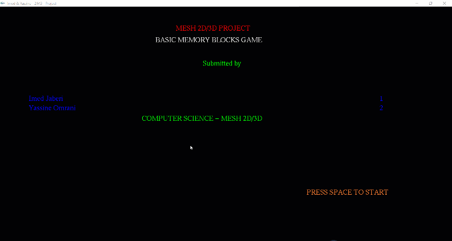

# MESH COMPUTER GRAPHICS UNIVERSITY PROJECT
---
### Our computer graphics (mesh) project using OpenGL with C/C++ for university exam ..
 
## What technologies that i used ?
 - C/C++
 - OpenGL
 - Glut ( OpenGL Graphics Utility Library )

## Setup prerequists
  

## How to run the application
 - After Config , run it like all others c/c++ files ( cli => gcc/g++ / gui ide => compiler & run button ) ..

## Collaborators
  - [Imed Jaberi](https://github.com/3imed-jaberi)
  - [Yassine Omrani](https://github.com/YassineOmrani)
## Demo 

#### License
---
[Apache 2.0](https://choosealicense.com/licenses/apache-2.0/)  